# Research pipeline — gate logic

What actually runs, in order, and what rejects a candidate at each stage. This is
not a software architecture diagram; it is the sequence of statistical gates a
pair or basket has to clear before it is a candidate for paper trading. Every
box below is one script under `code/`; every red edge is a real rejection this
project has produced.

## Full pipeline

```mermaid
flowchart TD
    START(["a symbol universe,\ne.g. crypto-all, 18 coins"]) --> S0

    subgraph STEP0["Step 0 — is there a relationship at all"]
        S0["pair_report.py\nEngle-Granger, hedge ratio,\nOU half-life"]
    end
    S0 -->|"p >= level, OR\nhalf-life outside 2-30 bars"| R0["REJECT\nno usable relationship"]
    S0 -->|passes| SCREEN

    subgraph SCREENING["screen.py / basket_screen.py — the wide search"]
        SCREEN["evaluate every pair/basket\nin the universe"]
        SCREEN --> HOLD["reserve a window\nat EACH end (--holdout)\nnever seen while ranking"]
        HOLD --> LINK{"--require-link:\nshare a named driver?\n(sector / currency leg /\ncommodity / crypto-beta)"}
        LINK -->|no shared driver| R_LINK["REJECT\nno economic link\n(caught XLP~XLB)"]
        LINK -->|shared or n/a in crypto| COINT{"cointegrated on the\nSCREENING window,\np < level?"}
        COINT -->|no| R_COINT["REJECT — noise\n(reported against\nN x level, corrected\nby multiple_testing.py)"]
        COINT -->|yes| OOS{"out-of-sample tail\nof screening window,\np_oos < level?"}
        OOS -->|no| R_OOS["REJECT"]
        OOS -->|yes| LATE{"LATE reserved window\n(never seen), p_late < level?"}
        LATE -->|no| R_LATE["REJECT — window-selection\nartifact\n(killed XLP~XLB, ALL~TRV,\nDOT~FIL)"]
        LATE -->|yes| SWING{"hedge-ratio swing across\nwindows <= max-beta-swing?\nsign change = auto-fail"}
        SWING -->|no| R_SWING["REJECT — not one\nrelationship, several\n(17x and 9x swings seen)"]
        SWING -->|yes| NET{"net exposure <= 0.35?\n(legs actually cancel)"}
        NET -->|no| R_NET["REJECT — directional bet\nwearing a hedge\n(BNB~LINK: 67% net)"]
        NET -->|yes| HL{"half-life in bounds,\nIS and OOS agree?"}
        HL -->|no| R_HL["REJECT"]
        HL -->|yes| SURV(["statistical survivor"])
    end

    SURV --> REPLAY

    subgraph STEP1["Step 1 — does it survive real costs"]
        REPLAY["backtest.py / feasibility.py\nreplay through costs.py\nspread + commission + carry"]
        REPLAY --> EDGE{"expected move clears\nbreak-even after\ncost + financing?"}
        EDGE -->|no| R_EDGE["REJECT — cost/carry\neats the edge"]
        EDGE -->|yes| BTOK(["cost survivor"])
    end

    BTOK --> STEP2CHK

    subgraph STEP2["Step 2 — is it still alive, and hedged for real"]
        STEP2CHK["relationship_report.py\nADF / Engle-Granger / Johansen\nstatic vs rolling vs Kalman beta\nhealth monitor (3-state)"]
        STEP2CHK --> HEALTH{"cointegration PASS,\nhedge PASS, health PASS\non the FULL record\n(not just the fitted window)?"}
        HEALTH -->|no| R_HEALTH["REJECT — relationship\ndied outside the window\nit was selected on\n(DOT~FIL full record:\nhalf-life 46 IS / 168 OOS)"]
        HEALTH -->|yes| RELOK(["relationship confirmed"])
    end

    RELOK --> STEP3CHK

    subgraph STEP3["Step 3 — does the signal actually work"]
        STEP3CHK["outcomes.py — do trades hit\ntarget/stop/time as predicted?\nthresholds.py — where can it\nbe entered and still pay?\nrisk.py — how many independent\nbets does this book hold?\nsizing.py — growth-optimal size,\nhaircut by 1 standard error"]
        STEP3CHK --> COMPLETE{"completion rate and\npredicted-vs-realised\nmove reasonable?"}
        COMPLETE -->|no| R_COMPLETE["REJECT — expected move\noverpredicts realised by\n10x-68x on this project's\nown pairs"]
        COMPLETE -->|yes| SIZED(["sized signal"])
    end

    SIZED --> STEP4CHK

    subgraph STEP4["Step 4 — is the result real, or an artifact of the search"]
        MT["multiple_testing.py\nBenjamini-Hochberg + block\nbootstrap over the WHOLE\nscreened universe"]
        MT --> POPCHK{"bootstrap: observed\nrejections vs expected —\npopulation excess?"}
        POPCHK -->|"no excess, but\nindividual pair survives FDR"| WARN["flag: not corroborated\nby its own universe\n(DOT~FIL: p=0.423,\nyet clears FDR alone)"]
        POPCHK -->|excess| POPOK["population signal real"]
        WARN --> DS
        POPOK --> DS

        DS["deflated_sharpe.py\ncharge every logged trial\n(screens, backtests, sizing,\nthresholds — NOT itself)"]
        DS --> DSCHK{"deflated Sharpe:\nSharpe beats the\nbest-of-N-trials\nnoise benchmark?"}
        DSCHK -->|no| R_DS["REJECT — DSR near 0%\nPSR 89.7% -> DSR 0.1%\non DOT~FIL, 79 trials"]
        DSCHK -->|yes| OF

        OF["overfit.py\nCSCV: combinatorial\nsplit of the parameter sweep"]
        OF --> OFCHK{"probability of backtest\noverfitting <= 50%?"}
        OFCHK -->|no, and usually\nworse than random| R_OF["REJECT — PBO 67.5%,\nmedian log-odds -0.69\n(worse than a coin flip:\nselection on noise reverts)"]
        OFCHK -->|yes| PCV

        PCV["purged_cv.py\npurge + embargo around\neach fold boundary"]
        PCV --> PCVCHK{"purged score collapses\nrelative to plain score?\n(needs >= ~5-10% of rows\npurged to mean anything)"}
        PCVCHK -->|collapses| R_PCV["REJECT — leakage:\nscore was inflated by\ncross-fold overlap"]
        PCVCHK -->|holds, or\nNOT TESTED\nat this horizon| VALIDATED(["validated candidate"])
    end

    R0 --> DEAD(["dead end — back to\na wider/different\nuniverse or timeframe"])
    R_LINK --> DEAD
    R_COINT --> DEAD
    R_OOS --> DEAD
    R_LATE --> DEAD
    R_SWING --> DEAD
    R_NET --> DEAD
    R_HL --> DEAD
    R_EDGE --> DEAD
    R_HEALTH --> DEAD
    R_COMPLETE --> DEAD
    R_DS --> DEAD
    R_OF --> DEAD
    R_PCV --> DEAD

    VALIDATED --> STEP5

    subgraph LIVE["Step 5-7 — forward test only, never a backtest substitute"]
        STEP5["Step 5: paper —\nreal-time data, real broker\nplumbing, no real money.\nMeasures real fills/spread/swap\nagainst costs/*.json estimates.\nProves NOTHING about edge if\nthe candidate above is weak."]
        STEP5 --> STEP6["Step 6: live —\nsmall real size"]
        STEP6 --> STEP7["Step 7: other asset\nclasses — repeat Step 0-4"]
    end

    style R0 fill:#5a1f1f,color:#fff
    style R_LINK fill:#5a1f1f,color:#fff
    style R_COINT fill:#5a1f1f,color:#fff
    style R_OOS fill:#5a1f1f,color:#fff
    style R_LATE fill:#5a1f1f,color:#fff
    style R_SWING fill:#5a1f1f,color:#fff
    style R_NET fill:#5a1f1f,color:#fff
    style R_HL fill:#5a1f1f,color:#fff
    style R_EDGE fill:#5a1f1f,color:#fff
    style R_HEALTH fill:#5a1f1f,color:#fff
    style R_COMPLETE fill:#5a1f1f,color:#fff
    style R_DS fill:#5a1f1f,color:#fff
    style R_OF fill:#5a1f1f,color:#fff
    style R_PCV fill:#5a1f1f,color:#fff
    style DEAD fill:#3a3a3a,color:#fff
    style VALIDATED fill:#1f5a2e,color:#fff
    style SURV fill:#2f4a5a,color:#fff
    style BTOK fill:#2f4a5a,color:#fff
    style RELOK fill:#2f4a5a,color:#fff
    style SIZED fill:#2f4a5a,color:#fff
    style WARN fill:#5a4a1f,color:#fff
```

## Why the order is what it is

Steps do not run in the order they were named in `PLAN.md`. `plan/STEP4.md`
records the actual reason: population correction has to run before an
individual pair's Sharpe is deflated, because the number of trials charged to
one pair depends on how many pairs were screened around it, and that number
only exists once the whole universe has been screened. Running deflation first
would charge each pair its own trial count and miss the population it was
drawn from.

## What has actually reached each gate

Concrete outcomes from this project's own runs, not hypothetical:

| Candidate | Furthest gate reached | What killed it |
|---|---|---|
| `XLP~XLB` | late reserved window | cointegrated only on the window that selected it |
| `ALL~TRV` | late reserved window | same shape; −4,870 bps gross over 30 years |
| `NUE~STLD` | deflated Sharpe | PSR 80.5% → DSR 3.5%, 78 trials charged |
| `RSG~WM` | overfit / PBO | PBO 76.6% |
| `KEY~ZION` | overfit / PBO | PBO 66.7% |
| `DOT~FIL` (crypto) | overfit / PBO | DSR 0.1% (79 trials), PBO 67.5%, log-odds −0.69 |
| `BNB~LINK` (crypto) | net-exposure gate | lowest p-value in its universe, 67% net exposure — a directional bet |
| ~1,300 other pair/basket studies | screening gates | below-chance cointegration counts, sign-flipping hedge ratios, dead late windows |

**Zero candidates have reached `VALIDATED` as of this diagram.** The pipeline
is built and verified — 595 checks across five suites — and every gate has
independently killed real candidates at least once, which is what "verified"
means here: not that the code runs without error, but that each rejection
condition has fired on real data and matched the reason recorded next to it.

## Simplifications

- Step 3's three scripts (`outcomes.py`, `thresholds.py`, `risk.py`,
  `sizing.py`) are folded into one box; each has its own internal checks
  documented in `plan/STEP3.md` and is not a single pass/fail gate the way
  Steps 0, 1, 2 and 4 are.
- `signal_report.py` and `validation_report.py` are omitted — they render an
  HTML page of what the gates above already decided and change no verdict.
- `triallog.py` is omitted as a diagram node; it is the shared logging
  primitive every gate above writes through, not a gate itself.
- The population-correction branch (`multiple_testing.py`) is drawn feeding
  into deflation rather than as a parallel gate, because `plan/STEP4.md`
  states the count it produces is what the deflation benchmark consumes.
