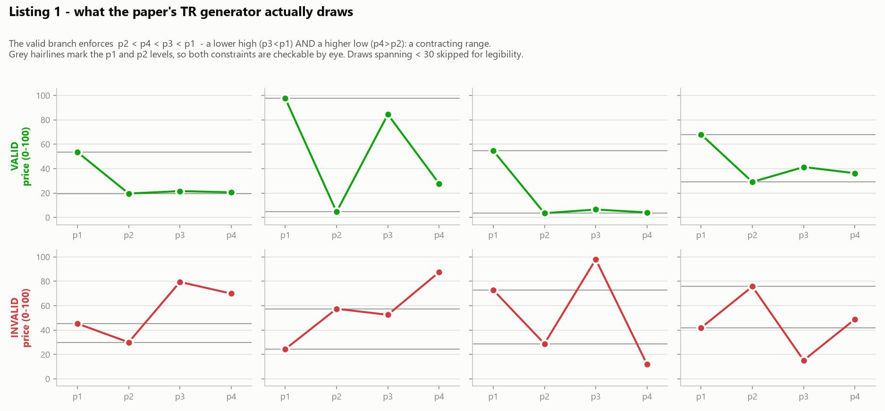
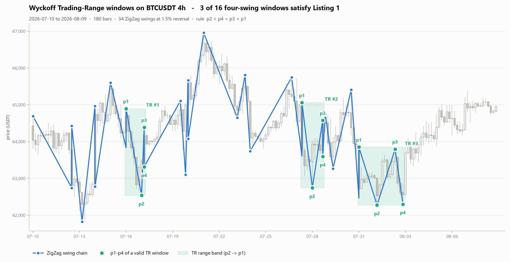
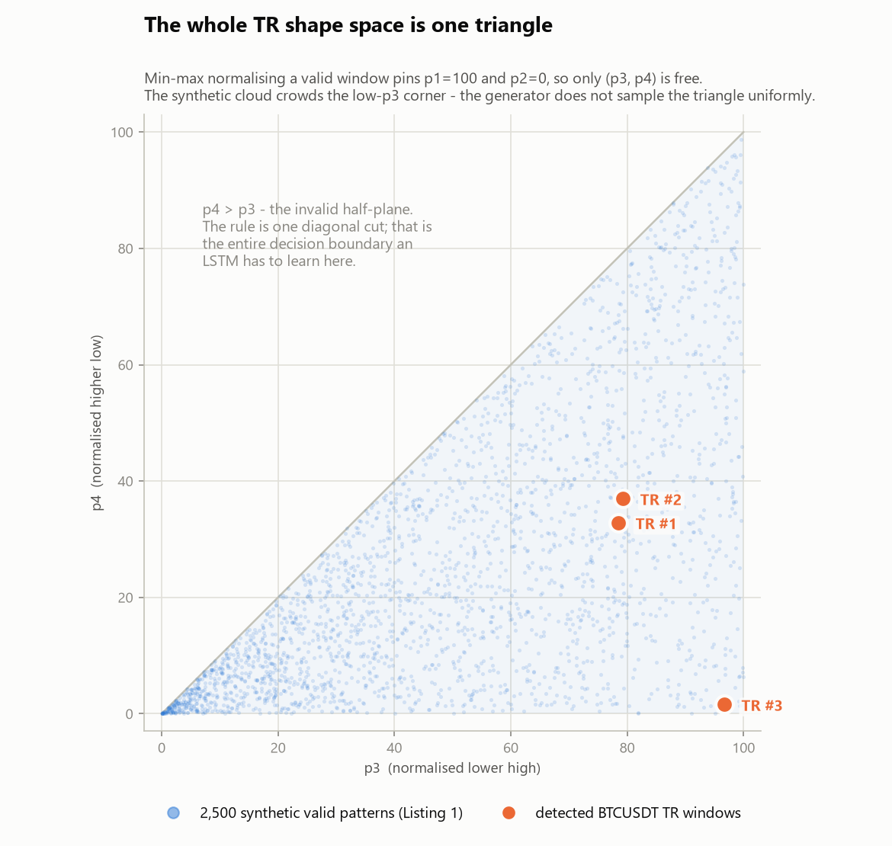

# POC 01 — Wyckoff Trading-Range phase (Listing 1)

Spec and write-up for the first Wyckoff POC. Implementation lives in
[`wychoff_poc.ipynb`](wychoff_poc.ipynb).

| | |
|---|---|
| **Source paper** | *Long Short-Term Memory Pattern Recognition in Currency Trading* — Jai Pal, arXiv:2403.18839v1 |
| **PDF** | [`research/paper/wyckoff/2403.18839_LSTM_Wyckoff_Currency_Trading.pdf`](../../research/paper/wyckoff/2403.18839_LSTM_Wyckoff_Currency_Trading.pdf) |
| **Digest** | [`research/wiki/wyckoff/2403.18839_..._digest.md`](../../research/wiki/wyckoff/2403.18839_LSTM_Wyckoff_Currency_Trading_digest.md) |
| **In scope** | Listing 1 (p.5) — the Trading Range phase geometry |
| **Out of scope** | Listing 2 (Secondary Test), Listing 3 (filler), Listing 4 (the LSTM) |
| **Data** | BTCUSDT 4h, 180 bars (~30 days), Binance public spot API |
| **Deliverable** | 3 PNGs in [`images/`](images/) |

---

## 1 · Objective

The paper reduces the Wyckoff Trading Range to five inequalities over four price points, then
reports **99.34% test accuracy** for an LSTM trained to recognise them — but **every one of those
examples came from the paper's own random generator**. No real price data appears anywhere in
the study.

This POC asks the two questions that gap leaves open:

1. **What does the rule actually select on a real chart?** Apply Listing 1's geometry, unmodified,
   to BTCUSDT swings and look at what gets flagged.
2. **Is the reported accuracy measuring anything about markets?** Characterise the decision
   boundary the model was asked to learn, and check whether real windows occupy the same region
   of shape space as the synthetic ones.

No neural network is needed to answer either. The rule is five inequalities — evaluating it
takes one line. The LSTM is only how the paper *learns* the rule, not what the rule *is*.

---

## 2 · The algorithm

### 2.1 Listing 1 as printed (p.5)

```python
def generate_pattern(validity):
    if validity:
        p1 = random.uniform(0, 100)
        p2 = random.uniform(0, p1)
        p3 = random.uniform(p2, p1)
        p4 = random.uniform(p2, p3)
        return [validity, p1, p2, p3, p4]
    if not validity:
        pattern = [validity, random.uniform(0,100), random.uniform(0,100),
                   random.uniform(0,100), random.uniform(0,100)]
        if pattern[1] > pattern[2] and pattern[2] < pattern[3] \
           and pattern[4] < pattern[3] and pattern[3] < pattern[1] \
           and pattern[4] > pattern[2]:
            pattern.remove(pattern[0]); pattern.insert(0, True)
        return pattern
```

### 2.2 The rule, collapsed

The five inequalities in the relabel check are the same constraints the valid branch samples
under. They are not independent — they collapse to a single ordering chain:

$$p_1 > p_2,\quad p_2 < p_3,\quad p_4 < p_3,\quad p_3 < p_1,\quad p_4 > p_2
\qquad\Longleftrightarrow\qquad
\boxed{\,p_2 < p_4 < p_3 < p_1\,}$$

With the four swings alternating **High, Low, High, Low**, the chain reads as:

| Constraint | Meaning |
|---|---|
| $p_3 < p_1$ | the second high is a **lower high** |
| $p_4 > p_2$ | the second low is a **higher low** |
| $p_2 < p_1$, $p_2 < p_3$, $p_4 < p_3$ | the range holds — nothing breaks out |

A lower high plus a higher low is a **contracting range**.

### 2.3 ⚠️ The code contradicts the paper's prose

§2.1 of the paper says the trading range forms *"lower lows and lower highs"*. A lower low means
$p_4 < p_2$. **Listing 1 requires $p_4 > p_2$ — the exact opposite.**

This is not a rounding of language: the two rules select disjoint sets. The LSTM was trained on
the code, so the code is treated as authoritative here. `tr_rule_prose()` in the notebook
implements the prose version so both can be run against the same swing chain — §5 shows they
disagree by 2–4× on detection count.

### 2.4 The invalid branch is ~4.17% mislabelled

Four i.i.d. $U(0,100)$ draws have $4! = 24$ equally likely orderings, exactly one of which is
$p_2 < p_4 < p_3 < p_1$. So $1/24 = 4.1667\%$ of samples generated on the "invalid" branch get
silently relabelled `True`. Monte Carlo over 200,000 draws in the notebook measures **4.187%** —
matching theory. It is label noise in the negative class, and it is in the paper as published.

---

## 3 · The step the paper does not specify

The paper generates $p_1..p_4$ directly. To run the rule on a chart, something must **produce**
those four points from OHLC bars — and the paper never says how. That bridge is this POC's own
addition and it is the dominant free variable in the whole pipeline.

| Stage | Choice made here | Why |
|---|---|---|
| **Swing detection** | Percentage-reversal **ZigZag**: confirm a swing high once price falls `PCT` from it; confirm a swing low once price rises `PCT` from it. Output alternates `H, L, H, L…` | Simplest detector that produces exactly the alternating extrema the rule assumes. No lookahead beyond the confirming bar. |
| **Windowing** | Slide a 4-swing window that **starts on a High** → $(p_1,p_2,p_3,p_4) = (H,L,H,L)$ | Listing 1's ordering only makes sense if $p_1,p_3$ are highs and $p_2,p_4$ are lows. |
| **Scaling** | None | The rule is pure ordering, hence scale-invariant. Normalisation is used only in Fig. 3, to *compare* shapes. |
| **Overlap** | Windows may overlap (stride = 1 swing) | Matches a sliding-window scanner; a real system would dedupe. |

`PCT = 1.5%` is the default. It is a parameter the paper does not have, and §5 quantifies how
much it moves the answer.

---

## 4 · How to run

```bash
# from repo root, with the project venv
.venv/Scripts/python.exe -m pip install requests pandas numpy matplotlib
```

Open [`wychoff_poc.ipynb`](wychoff_poc.ipynb) and run all cells. No TensorFlow required.

Config lives in one block at the top of the notebook:

| Parameter | Default | Effect |
|---|---|---|
| `SYMBOL` | `BTCUSDT` | Binance spot pair |
| `INTERVAL` | `4h` | kline interval |
| `LIMIT` | `180` | bars fetched (~30 days) — deliberately narrow; this is a POC |
| `PCT` | `0.015` | ZigZag reversal threshold |
| `SEED` | `7` | synthetic-draw seed for Fig. 1 |

First run fetches from `https://api.binance.com/api/v3/klines` and caches to
`data/{SYMBOL}_{INTERVAL}_{LIMIT}.csv` (gitignored), so re-runs are reproducible and offline.
Delete the CSV to refresh. Figures are written to `images/`.

---

## 5 · Results

Run of 2026-08-09 — BTCUSDT 4h, 180 bars, `2026-07-10 12:00 → 2026-08-09 08:00`, `PCT = 1.5%`.

**34 swings → 16 H-led windows → 3 valid TR (18.8% hit rate)**

| | window | p1 | p2 | p3 | p4 | range |
|---|---|---|---|---|---|---|
| TR #1 | 07-16 12:00 → 07-17 16:00 | 64,896 | 62,538 | 64,388 | 63,312 | 2,358 (3.77%) |
| TR #2 | 07-27 20:00 → 07-29 04:00 | 65,056 | 62,742 | 64,576 | 63,598 | 2,314 (3.69%) |
| TR #3 | 07-31 12:00 → 08-03 08:00 | 63,849 | 62,275 | 63,796 | 62,300 | 1,574 (2.53%) |

### Fig. 1 — what Listing 1 actually draws



Top row: valid draws. Grey hairlines mark the $p_1$ and $p_2$ levels, so *lower high* and
*higher low* are checkable by eye. Bottom row: invalid draws (accidental relabels excluded).

### Fig. 2 — the rule applied to BTCUSDT ← main output



Candles are recessive grey context. The blue chain is the ZigZag swing sequence the rule
consumes. Each aqua box is a window satisfying $p_2 < p_4 < p_3 < p_1$, drawn from the range
floor $p_2$ to the ceiling $p_1$.

### Fig. 3 — the shape space



Min–max normalising a valid window pins $p_1 = 100$ and $p_2 = 0$ **by construction** — the rule
already declares $p_1$ the max and $p_2$ the min. So the entire TR shape space is the
two-dimensional triangle $0 < p_4 < p_3 < 100$, and the decision boundary is the single line
$p_4 = p_3$.

### Sensitivity to the ZigZag threshold

| `PCT` | swings | windows | valid (Listing 1) | valid (prose "lower low") |
|---|---|---|---|---|
| 0.8% | 128 | 63 | 4 | 17 |
| 1.0% | 94 | 46 | 1 | 14 |
| **1.5%** | **34** | **16** | **3** | **6** |
| 2.0% | 24 | 11 | 3 | 2 |
| 3.0% | 12 | 5 | 1 | 2 |

Detection count is non-monotonic in `PCT` and the two rule variants disagree by 2–4×.

---

## 6 · Findings

1. **Listing 1 encodes a contracting range, not the pattern §2.1 describes.** Lower high *and
   higher low*, versus the prose's "lower lows and lower highs". The two rules select materially
   different windows from the same swing chain. The trained model learned the code's rule.

2. **The classification problem behind the 99.34% is a single linear cut.** In the normalised
   coordinates of Fig. 3 the boundary is the line $p_4 = p_3$. An LSTM separating that
   near-perfectly is a statement about the generator, not about markets — a two-line comparison
   scores 100%.

3. **The negative class carries ~4.17% label noise**, measured at 4.187% over 200k draws.

4. **The hard part is the step the paper skips.** The swing detector is unspecified in the paper
   and its threshold swings the detection count several-fold. Any real deployment inherits `PCT`
   (or an equivalent) as its dominant free parameter, and the paper offers no guidance on it.

5. **The rule is a shape filter, not a signal.** It has no notion of volume, of how long the range
   has held, or of where the range sits within a larger trend — all of which Wyckoff's own method
   treats as essential. TR #3 above has $p_4 - p_2 = 25$ USDT on a 1,574 USDT range: technically a
   higher low, practically a flat double bottom. The rule cannot tell those apart.

6. **The final 36 bars carry no swings at all.** After the last pivot on 08-03 08:00 BTCUSDT consolidated inside
   1.5%, so the ZigZag confirms nothing — the detector goes blind on exactly the kind of tight
   consolidation a Wyckoff trading range is supposed to be. Worth remembering before treating
   detection count as a measure of market structure.

---

## 7 · Next steps

| # | Item | Note |
|---|---|---|
| 02 | ~~**Listing 2 — Secondary Test phase**~~ | ✅ **Done** — [`02_secondary_test_phase.md`](02_secondary_test_phase.md). Found that `upFiller` silently discards `p4`, so the published ST model learned a double bottom rather than a multi-test structure. |
| 03 | **Listing 4 — the LSTM** | Train on synthetic (Listings 1–3), then run sliding-window inference over BTCUSDT and compare the sigmoid confidence against this notebook's exact rule. The interesting output is not accuracy — it is *where the model and the rule disagree* on real bars. Needs TensorFlow (not currently in `.venv`). |
| 04 | **Fix the generator** | Drop the accidental relabel; make the invalid branch sample *near* the boundary instead of uniformly, so the negative class is actually hard. |
| 05 | **Swing-detector ablation** | Replace ZigZag with fractal / ATR-scaled pivots and re-measure. If detections move as much as the `PCT` sweep suggests, the detector — not the Wyckoff rule — is the model. |
| 06 | **Does a TR predict anything?** | Forward-return distribution after each detected window vs. a matched random-window baseline. The paper never asks this, and it is the only question that decides whether any of it is tradeable. |

---

*POC run: 2026-08-09 · BTCUSDT 4h · Binance spot*
