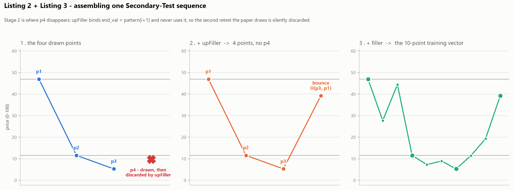
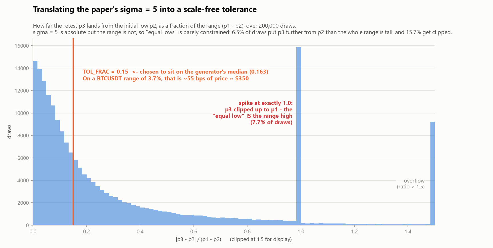
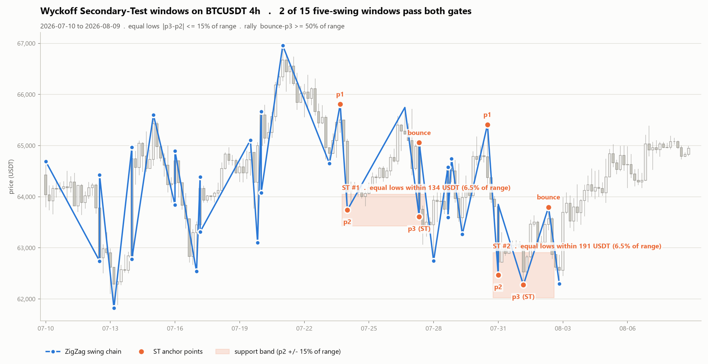
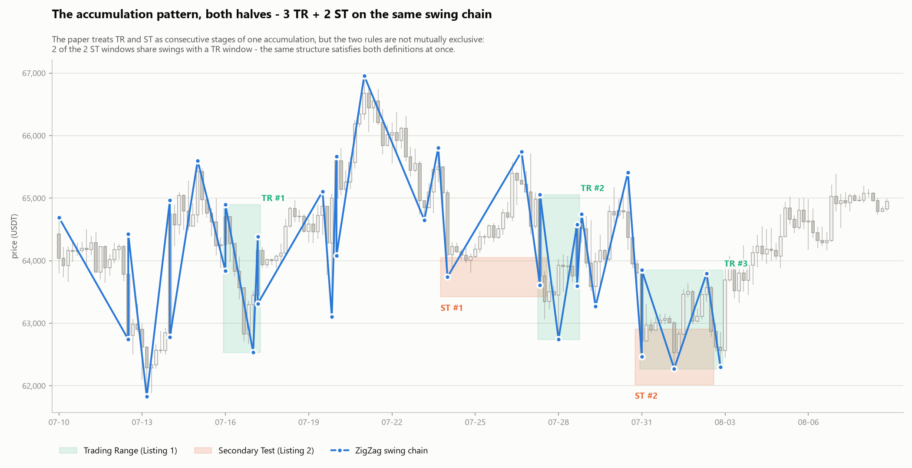

# POC 02 — Wyckoff Secondary-Test phase (Listing 2)

Spec and write-up for the second Wyckoff POC. Implementation lives in
[`02_secondary_test_poc.ipynb`](02_secondary_test_poc.ipynb).

| | |
|---|---|
| **Source paper** | *Long Short-Term Memory Pattern Recognition in Currency Trading* — Jai Pal, arXiv:2403.18839v1 |
| **PDF** | [`research/paper/wyckoff/2403.18839_LSTM_Wyckoff_Currency_Trading.pdf`](../../research/paper/wyckoff/2403.18839_LSTM_Wyckoff_Currency_Trading.pdf) |
| **In scope** | Listing 2 (p.5, ST generator) + Listing 3 (p.6, `filler` / `upFiller`) |
| **Out of scope** | Listing 4 (the LSTM) |
| **Previous POC** | [`01_trading_range_phase.md`](01_trading_range_phase.md) |
| **Data** | BTCUSDT 4h, 180 bars — the **same slice** as POC 01, so results are directly comparable |
| **Deliverable** | 4 PNGs in [`images/`](images/) (`fig4`–`fig7`) |

---

## 1 · Objective

POC 01 covered the Trading Range — the first half of the accumulation pattern. This POC covers
the second half: the **Secondary Test**, where price returns to a prior support level and makes
"uniform and equal lows" (§2.2), which the paper argues creates the liquidity that fuels a
breakout.

Two questions:

1. **What does Listing 2 actually generate?** POC 01 found that Listing 1's code contradicted the
   paper's prose. Listing 2 is more complex — it composes three functions — so it warrants the
   same line-by-line trace before anything is built on it.
2. **What does the rule select on a real chart?** Same ZigZag bridge, same BTCUSDT slice, so ST
   detections can be laid beside POC 01's TR detections on one chart.

---

## 2 · The algorithm

### 2.1 Listing 2 as printed (p.5)

```python
def generate_pattern(validity):
    if validity:
        p1 = random.uniform(0, 100)     # range high
        p2 = random.uniform(0, p1)      # initial support low
        p3 = random.gauss(p2, 5)        # retest 1 — "equal low"
        p4 = random.gauss(p2, 5)        # retest 2 — "equal low"
        p3 = min(max(0, p3), p1)
        p4 = min(max(0, p4), p1)
        pattern1 = [validity, p1, p2]
        pattern2 = upFiller([p3, p4], p1)
        final_pattern = filler(pattern1 + pattern2)
        return final_pattern
```

There is **no `if not validity:` branch**. The paper never prints how the 100,000 ST negatives
in §6 were generated.

### 2.2 🔴 `upFiller` discards `p4`

```python
def upFiller(pattern, upperLimit):
    new_pattern = []
    for i in range(len(pattern) - 1):     # len=2 → range(1) → i=0 only
        start_val = pattern[i]            # p3
        new_pattern.append(start_val)     # [p3]
        end_val = pattern[i + 1]          # p4 — bound, NEVER read
        num_fillers = 1
        for _ in range(num_fillers):
            new_pattern.append(random.uniform(start_val, upperLimit))   # U(p3, p1)
    return new_pattern                    # [p3, bounce]  — p4 is gone
```

`end_val` is assigned and never used, and unlike `filler` the function never appends
`pattern[-1]` after the loop. `upFiller([p3, p4], p1)` returns `[p3, bounce]`.

**`p4` is drawn, clipped to `[0, p1]`, and thrown away.** Verified in the notebook §1.

**Consequence.** The ST phase is *defined* by repeated tests of support. The generator draws
three lows — `p2`, `p3`, `p4` — and emits two. The model reporting **99.98% test accuracy** was
trained to recognise a **double bottom**, not the multi-test structure §2.2 describes. This is a
defect in the artifact, not a deliberate simplification of it.

### 2.3 The assembled sequence

`filler(pattern1 + pattern2)` = `filler([True, p1, p2, p3, bounce])` inserts 2 uniform points
between each consecutive pair and appends the last, giving 10 price points:

```
[True, p1, f, f, p2, f, f, p3, f, f, bounce]
```

So `n_features = 10` for the ST model, against 4 for the TR model.

### 2.4 `filler` cannot overshoot

`random.uniform(a, b)` accepts `a > b`, so every filler point lands strictly *between* its two
bracketing swing points. The synthetic path is **monotone between swings and never overshoots a
level**. Real price does nothing of the sort — which matters for §3 below.

---

## 3 · Translating `σ = 5`

`p3 ~ gauss(p2, 5)` is an **absolute** spread on a hardcoded 0–100 axis. BTCUSDT trades near
63,000, so σ must become a *relative* band. The scale-free quantity is the gap as a fraction of
the range:

$$\text{gap ratio} = \frac{|p_3 - p_2|}{p_1 - p_2}$$

Measured over 200,000 generator draws (notebook §2):

| Statistic | Value |
|---|---|
| median gap ratio | **0.163** |
| P(ratio > 1) — retest further from `p2` than the range is tall | **6.5%** |
| `p3` clipped **up** to `p1` — the "equal low" *is* the range high | **7.74%** |
| `p3` clipped **down** to 0 | **7.93%** |
| any clip | **15.67%** |

`TOL_FRAC = 0.15` is set to sit on that median — chosen, not guessed. On a BTCUSDT range of 3.7%
that is ≈ 55 bps of price ≈ $350.

**The finding is that `σ = 5` is not really a tolerance.** `p1 − p2` is itself random and
uncontrolled, so the same absolute σ means "razor tight" for a wide range and "wider than the
whole range" for a narrow one. Nearly one draw in six is clipped, and on 7.7% of draws the
supposed equal **low** is pinned to the range **high** — a training example labelled valid whose
geometry is the opposite of the pattern.

---

## 4 · Detection on a real swing chain

Same percentage-reversal ZigZag as POC 01 (`PCT = 1.5%`). The paper's sequence is
`p1 (high) → p2 (low) → p3 (low) → bounce (high)`, which on an alternating chain maps to a
**5-swing window** `H, L, H, L, H` = $(p_1, p_2, \text{mid}, p_3, \text{bounce})$.

Two gates, one per surviving generator constraint:

| Gate | Derived from | Test | Default |
|---|---|---|---|
| **equal lows** | `p3 ~ gauss(p2, 5)` | $\lvert p_3 - p_2 \rvert \le$ `TOL_FRAC` $\times (p_1 - p_2)$ | 0.15 |
| **the rally** | `upFiller` draws `U(p3, p1)` | $\text{bounce} - p_3 \ge$ `BOUNCE_FRAC` $\times (p_1-p_2)$ | 0.50 |

### Why `mid` is not gated

`mid` — the swing high between the two lows — is **deliberately left un-gated**, kept only as a
diagnostic. In the generator that stretch is produced by `filler`, and §4.2 of the paper
explicitly calls filler points *noise* introduced for generalisation, not structure. Treating
them as a constraint would be a misreading.

It also would not work. `filler` draws `U(p2, p3)` between the two lows, so the synthetic path
never leaves the tolerance band between retests — whereas a ZigZag chain **must** place a swing
high there, at least `PCT` above the low. Gating `mid` at the paper's own tolerance gives
**0 of 15** windows. The paper's noise model and a swing representation are structurally
incompatible: the generator does not emit sequences a swing detector could have produced.

---

## 5 · How to run

Open [`02_secondary_test_poc.ipynb`](02_secondary_test_poc.ipynb) and run all cells. No
TensorFlow. It reuses POC 01's cached `data/BTCUSDT_4h_180.csv`, re-fetching from Binance only if
absent.

| Parameter | Default | Effect |
|---|---|---|
| `PCT` | `0.015` | ZigZag reversal threshold (from POC 01) |
| `TOL_FRAC` | `0.15` | equal-lows band, as a fraction of range |
| `BOUNCE_FRAC` | `0.50` | minimum rally after the retest |

---

## 6 · Results

BTCUSDT 4h, 180 bars, `2026-07-10 12:00 → 2026-08-09 08:00`.

**34 swings → 15 H-led 5-swing windows → 2 valid ST**

| | window | p2 | p3 | gap | bounce |
|---|---|---|---|---|---|
| ST #1 | 07-24 12:00 → 07-27 20:00 | 63,740 | 63,606 | 134 (6.5% of range) | 65,056 |
| ST #2 | 07-31 12:00 → 08-02 20:00 | 62,466 | 62,275 | 191 (6.5% of range) | 63,796 |

Gate breakdown: equal-lows passes 2/15, rally passes 13/15 — **the equal-lows gate is what binds**.

Diagnostics on the un-gated interior high: stays in the lower half of the range in 1/15 windows;
inside the tolerance band itself (the literal `filler` reading) in **0/15**.

### Fig. 4 — the assembly pipeline, and where `p4` vanishes



### Fig. 5 — translating `σ = 5`



### Fig. 6 — the rule applied to BTCUSDT ← main output



### Fig. 7 — both halves of the accumulation pattern



### Sensitivity — two more parameters the paper does not have

Valid ST count:

| `TOL_FRAC` | bounce ≥ 0.25 | bounce ≥ 0.50 | bounce ≥ 0.75 |
|---|---|---|---|
| 0.05 | 0 | 0 | 0 |
| 0.10 | 2 | 2 | 0 |
| **0.15** | 2 | **2** | 0 |
| 0.20 | 3 | 3 | 1 |
| 0.30 | 3 | 3 | 1 |

---

## 7 · Findings

1. **`upFiller` discards `p4`.** The published ST model — 99.98% accuracy — was trained on a
   two-low double bottom, not the multi-test structure the paper describes. See §2.2.

2. **`σ = 5` is an accident of scale, not a tolerance.** Median gap ratio 0.163, but 6.5% of
   draws place the retest further from `p2` than the range is tall, 15.7% get clipped, and 7.7%
   pin the "equal low" to the range high. See §3.

3. **The noise model is incompatible with a swing representation.** `filler` never leaves the
   tolerance band between retests; a ZigZag chain must. Gating on it yields 0 detections. See §4.

4. **TR and ST are not mutually exclusive — and here they never occur apart.** **Both** ST
   windows share swings with a TR window (2 of 2, Fig. 7): ST #1 with TR #2, ST #2 with TR #3.
   Wyckoff treats them as ordered stages; the rules as written carry no ordering, no state, and
   no memory of which stage came before. Two independent binary classifiers cannot express
   "ST *follows* TR", which is the entire content of the accumulation narrative — and on this
   slice the two detectors are not even firing on distinct structures.

5. **Two more free parameters, still none from the paper.** `TOL_FRAC` and `BOUNCE_FRAC` join
   POC 01's `PCT`; detections move 0 → 3 across plausible settings. The paper contributes the
   *shape*; every number that makes it operational is supplied downstream.

6. **ST is the stricter pattern**, as expected — 2 detections vs TR's 3, with the equal-lows gate
   rejecting 13 of 15 windows.

### Running tally across both POCs

| Defect | Where | Effect |
|---|---|---|
| Prose says "lower lows", code requires a higher low | Listing 1 | TR model learned a contracting range |
| `invalid` branch relabels ~4.17% of negatives to `True` | Listing 1 | label noise in the negative class |
| `upFiller` discards `p4` | Listing 3 | ST model learned a double bottom |
| No `if not validity` branch for ST | Listing 2 | negative generation unpublished |
| `σ = 5` absolute against a random range | Listing 2 | "equal lows" barely constrained; 15.7% clipped |
| `filler` cannot overshoot | Listing 3 | synthetic paths are not swing-representable |

Neither reported accuracy (99.34%, 99.98%) is evidence about markets. Both are evidence that an
LSTM can fit a small generator — one of which is fitting a rule the paper did not intend to write.

---

## 8 · Next steps

| # | Item | Note |
|---|---|---|
| 03 | **Listing 4 — the LSTM** | Train on synthetic, run sliding-window inference on BTCUSDT, compare the sigmoid confidence to the exact rules from POC 01/02. Payload is *where model and rule disagree on real bars*. Needs TensorFlow (not in `.venv`). |
| 04 | **Fix both generators and re-measure** | Restore `p4`; drop the TR relabel; sample negatives near the boundary instead of uniformly; replace `σ = 5` with a relative band. Then ask what accuracy a corrected benchmark reports. |
| 05 | **Sequence-aware accumulation detector** | Require ST to *follow* TR within N bars — the ordering the paper asserts but never encodes. Finding #4. |
| 06 | **Swing-detector ablation** | Fractal / ATR-scaled pivots vs. ZigZag, across `PCT` × `TOL_FRAC`. Carried over from POC 01. |
| 07 | **Does any of it predict?** | Forward-return distribution after TR, after ST, and after TR→ST in sequence, vs. a matched random-window baseline. Needs a much wider data range. The only item that decides tradeability. |

---

*POC run: 2026-08-09 · BTCUSDT 4h · Binance spot*
